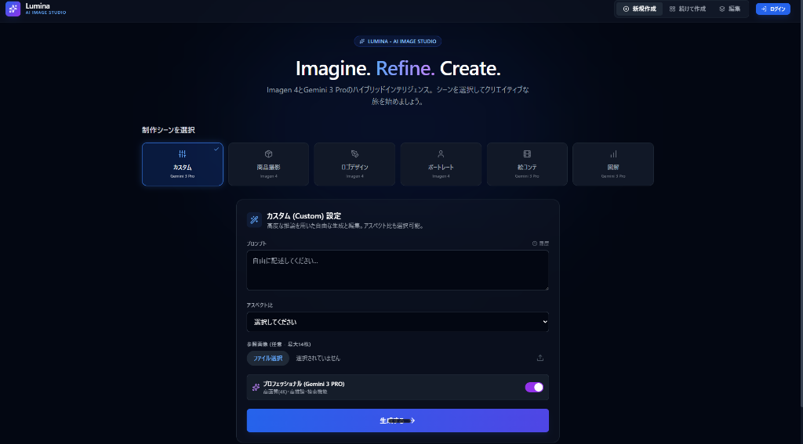

<div align="center">
  
  
  <h1>✨ Lumina - AI Image Studio v1.1</h1>
  
  <p align="center">
    <strong>Imagen 4 と Gemini 3 Pro を搭載したハイブリッドAI画像生成・編集スイート</strong>
    <br />
    <em>想像する。洗練する。創造する。</em>
  </p>

  <p align="center">
    <a href="#-プロジェクトについて"><strong>プロジェクトを見る »</strong></a>
    <br />
    <br />
    <a href="https://ai.studio/apps/drive/1nUEPgqlNFoo7lhBSLwH6IjjyRfqoGInE">デモを見る</a>
    ·
    <a href="https://github.com/yourusername/Lumina-v1.1/issues">バグ報告</a>
    ·
    <a href="https://github.com/yourusername/Lumina-v1.1/issues">機能リクエスト</a>
  </p>
</div>

<br />

---

## 📋 目次

- [プロジェクトについて](#-プロジェクトについて)
  - [主な機能](#主な機能)
  - [使用技術](#使用技術)
- [はじめに](#-はじめに)
  - [前提条件](#前提条件)
  - [インストール](#インストール)
  - [設定](#設定)
- [使い方](#-使い方)
  - [画像の作成](#画像の作成)
  - [画像の編集](#画像の編集)
  - [APIキーの管理](#apiキーの管理)
- [プロジェクト構造](#-プロジェクト構造)
- [ロードマップ](#-ロードマップ)
- [コントリビューション](#-コントリビューション)
- [ライセンス](#-ライセンス)
- [コンタクト](#-コンタクト)
- [謝辞](#-謝辞)

---

## 🎨 プロジェクトについて

**Lumina** は、Google の最先端技術である **Imagen 4**（画像生成）と **Gemini 3 Pro**（インテリジェントなプロンプト拡張と精緻化）を組み合わせた、高度なAI画像スタジオです。Lumina は、ゼロから美しい画像を作成し、既存の画像をAI搭載の編集ツールで洗練させるための、シームレスなデュアルモードインターフェースを提供します。

### 解決する課題

従来の画像生成ツールでは、以下のような課題がありました：
- 望む結果を得るために複数のステップが必要
- 手動でのプロンプトエンジニアリングの専門知識が必要
- 作成と編集に別々のツールが必要
- 反復的な改良に複雑なワークフローが必要

Lumina はこれらの課題を以下のように解決します：
- ✅ **統合された体験**: 作成と編集を単一のインターフェースで
- ✅ **インテリジェントなプリセット**: 10種類以上の厳選されたシーンテンプレートでクイックスタート
- ✅ **AI強化プロンプト**: Gemini 3 Pro が自動的に説明を豊かに
- ✅ **ビジュアル履歴**: 生成したすべての画像を追跡・再訪問
- ✅ **柔軟なAPI管理**: 複数の認証方法（AI Studio、ローカルストレージ、環境変数）

### 主な機能

#### 🎭 **シーンベースの作成**
- 10種類以上の専門的にデザインされたプリセット：
  - 🏔️ 風景写真
  - 👤 ポートレート写真
  - 🏙️ 都市景観
  - 🍕 フード写真
  - 🎨 デジタルアート
  - 🏢 商品写真
  - 🐾 動物・野生動物
  - 🌌 ファンタジー・SF
  - 🖼️ 抽象アート
  - ✏️ カスタムプロンプト

#### 🔧 **デュアルモードインターフェース**
1. **作成モード**: プリセットベースのテンプレートでゼロから画像を生成
2. **編集モード**: Gemini 搭載の提案で既存の画像を編集

#### 🧠 **AIハイブリッドインテリジェンス**
- **Imagen 4**: フォトリアリスティックな品質の最先端画像生成
- **Gemini 3 Pro**: インテリジェントなプロンプト拡張と創造的な提案
- **エコノミーモード**: オプションの Gemini Flash で高速かつコスト効率的な生成

#### 📸 **画像管理**
- IndexedDB による永続的なローカル履歴
- ワンクリックで PNG エクスポート
- 以前に生成した画像への素早いアクセス
- 画像から編集への自動ワークフロー

### 使用技術

[![React][React.js]][React-url]
[![TypeScript][TypeScript]][TypeScript-url]
[![Vite][Vite]][Vite-url]
[![TailwindCSS][Tailwind]][Tailwind-url]

**コア技術:**
- **React 19** - 並行機能を備えたモダンUIフレームワーク
- **TypeScript** - 型安全な開発
- **Vite** - 超高速ビルドツール
- **Lucide React** - 美しいアイコンライブラリ
- **Google Generative AI SDK** - Imagen 4 & Gemini 3 Pro 統合

---

## 🚀 はじめに

### 前提条件

Lumina をローカルで実行する前に、以下を確認してください：

- **Node.js** 18.0 以上
  ```sh
  node --version
  ```
- **npm** または **yarn**
  ```sh
  npm install npm@latest -g
  ```
- **Gemini APIキー**（課金が有効なもの）
  - APIキーの取得: [Google AI Studio](https://aistudio.google.com/app/apikey)
  - 課金の有効化: [Gemini API 課金ドキュメント](https://ai.google.dev/gemini-api/docs/billing)

> **注意**: Imagen 4 は、課金が有効な Google Cloud プロジェクトが必要です。Gemini API の無料プランでは画像生成モデルはサポートされていません。

### インストール

1. **リポジトリをクローン**
   ```sh
   git clone https://github.com/yourusername/Lumina-v1.1.git
   cd Lumina-v1.1
   ```

2. **依存関係をインストール**
   ```sh
   npm install
   ```

3. **APIキーを設定**（下記の[設定](#設定)を参照）

4. **開発サーバーを起動**
   ```sh
   npm run dev
   ```

5. **ブラウザで開く**
   ```
   http://localhost:5173
   ```

### 設定

Lumina は、APIキー認証のために **3つの方法** をサポートしています：

#### 方法1: AI Studio 環境（AI Studio デプロイに推奨）
- AI Studio にデプロイ: APIキーが自動的に挿入されます
- 手動設定は不要

#### 方法2: ローカルストレージ（ローカル開発に推奨）
- アプリ内の「ログイン」ボタンをクリック
- Gemini APIキーを入力
- キーはブラウザの `localStorage` に安全に保存されます

#### 方法3: 環境変数
- プロジェクトルートに `.env.local` ファイルを作成：
  ```env
  GEMINI_API_KEY=your_api_key_here
  ```
- 開発サーバーを再起動

> **セキュリティ注意**: APIキーをバージョン管理にコミットしないでください。`.env.local` ファイルはデフォルトで gitignore されています。

---

## 💡 使い方

### 画像の作成

#### ステップ1: シーンプリセットを選択
さまざまな創作ニーズに合わせて設計された10種類以上の厳選プリセットから選択：

- **風景写真**: 自然の景色、山、海
- **ポートレート写真**: プロフェッショナルなヘッドショット、芸術的なポートレート
- **都市景観**: モダン建築、ストリートフォトグラフィー
- **フード写真**: 料理、レストラン品質のショット
- **デジタルアート**: イラスト、コンセプトアート、デジタルペインティング
- その他...

#### ステップ2: 動的フォームフィールドに入力
各プリセットは、コンテキストに応じた入力フィールドを提供：
- **被写体**: 画像の主なフォーカス
- **スタイル/ムード**: 芸術的な方向性（例：「映画的」「ミニマリスト」）
- **色/照明**: ビジュアルの雰囲気

#### ステップ3: オプション - 参照画像をアップロード
- 最大3つの参照画像を追加
- Imagen 4 はそれらを使用してスタイル、構図、または被写体をガイド

#### ステップ4: 生成
- 「生成」をクリックして画像を作成
- 「エコノミーモード」をトグルして Gemini Flash でより高速な生成
- 画像履歴スライダーで結果を表示

### 画像の編集

#### 編集モードへのアクセス
- 履歴スライダーの任意の画像をクリック
- または生成後に「編集」タブに切り替え

#### 編集ツール
1. **AI搭載の提案**: Gemini から創造的な編集アイデアを取得
2. **手動編集**: 変更を指定（例：「背景を夕焼けに変更」）
3. **スタイル転送**: 新しい芸術的スタイルを適用
4. **ディテール強化**: 特定の領域を改善

#### エクスポート
- 「PNG保存」をクリックして高品質な画像をダウンロード

### APIキーの管理

#### 現在のステータスを表示
- 緑色の「API設定」ボタン: キーが有効
- 青色の「ログイン」ボタン: キーが未設定

#### APIキーをリセット
- 右上の「API設定」をクリック
- リセットを確認
- 新しいキーを再入力

---

## 📁 プロジェクト構造

```
Lumina-v1.1/
├── components/              # React コンポーネント
│   ├── CreationPanel.tsx    # 画像作成インターフェース
│   ├── RefinePanel.tsx      # 画像編集インターフェース
│   ├── SceneSelector.tsx    # プリセット選択UI
│   └── ImageHistorySlider.tsx # 履歴ナビゲーション
├── services/                # ビジネスロジック
│   └── storageService.ts    # IndexedDB 画像永続化
├── App.tsx                  # メインアプリケーションシェル
├── constants.ts             # シーンプリセット設定
├── types.ts                 # TypeScript 型定義
├── index.tsx                # アプリケーションエントリーポイント
├── index.html               # HTML テンプレート
├── vite.config.ts           # Vite ビルド設定
├── tsconfig.json            # TypeScript 設定
└── package.json             # プロジェクト依存関係
```

### 主要ファイル

- **`constants.ts`**: 10種類のシーンプリセットとそのフォーム構造を定義
- **`CreationPanel.tsx`**: Imagen 4 による画像生成を処理
- **`RefinePanel.tsx`**: 画像編集と Gemini の提案を管理
- **`storageService.ts`**: 永続的な画像履歴のための IndexedDB ラッパー

---

## 🗺️ ロードマップ

- [x] **v1.0**: Imagen 4 と Gemini 3 Pro による初回リリース
- [x] **v1.1**: エコノミーモードと改善されたモバイルナビゲーションを追加
- [ ] **v1.2**: 多言語サポート（英語、日本語、スペイン語）
- [ ] **v1.3**: 複数バリエーションのバッチ生成
- [ ] **v1.4**: 高度な編集ツール（インペインティング、アウトペインティング）
- [ ] **v2.0**: コミュニティプリセット共有とカスタムテンプレートビルダー

提案された機能と既知の問題の完全なリストについては、[オープンイシュー](https://github.com/yourusername/Lumina-v1.1/issues)を参照してください。

---

## 🤝 コントリビューション

コントリビューションは、オープンソースコミュニティを学び、インスピレーションを得て、創造するための素晴らしい場所にしています。あなたの貢献は **大歓迎** です！

### コントリビューション方法

1. **プロジェクトをフォーク**
2. **フィーチャーブランチを作成**
   ```sh
   git checkout -b feature/AmazingFeature
   ```
3. **変更をコミット**
   ```sh
   git commit -m 'Add some AmazingFeature'
   ```
4. **ブランチにプッシュ**
   ```sh
   git push origin feature/AmazingFeature
   ```
5. **プルリクエストを開く**

### 開発ガイドライン

- 既存の TypeScript と React パターンに従う
- すべてのコンポーネントが適切に型付けされていることを確認
- 作成モードと編集モードの両方で変更をテスト
- 新機能のドキュメントを更新

---

## 📜 ライセンス

MIT ライセンスの下で配布されています。詳細は `LICENSE` を参照してください。

---

## 📧 コンタクト

**プロジェクトメンテナー**: [Your Name]

- Email: your.email@example.com
- GitHub: [@yourusername](https://github.com/yourusername)
- プロジェクトリンク: [https://github.com/yourusername/Lumina-v1.1](https://github.com/yourusername/Lumina-v1.1)

**AI Studio デモ**: [https://ai.studio/apps/drive/1nUEPgqlNFoo7lhBSLwH6IjjyRfqoGInE](https://ai.studio/apps/drive/1nUEPgqlNFoo7lhBSLwH6IjjyRfqoGInE)

---

## 🙏 謝辞

- [Google Generative AI](https://ai.google.dev/) - Imagen 4 と Gemini 3 Pro API
- [Best-README-Template](https://github.com/othneildrew/Best-README-Template) - ドキュメントのインスピレーション
- [Lucide Icons](https://lucide.dev/) - 美しいアイコンライブラリ
- [Tailwind CSS](https://tailwindcss.com/) - ユーティリティファーストCSSフレームワーク
- [Vite](https://vitejs.dev/) - 次世代フロントエンドツール

---

<div align="center">
  <p>❤️ と ✨ AI で作成</p>
  <p>
    <a href="#top">トップに戻る ⬆️</a>
  </p>
</div>

<!-- バッジリファレンス -->
[React.js]: https://img.shields.io/badge/React-19.2.0-61DAFB?style=for-the-badge&logo=react&logoColor=black
[React-url]: https://reactjs.org/
[TypeScript]: https://img.shields.io/badge/TypeScript-5.8.2-3178C6?style=for-the-badge&logo=typescript&logoColor=white
[TypeScript-url]: https://www.typescriptlang.org/
[Vite]: https://img.shields.io/badge/Vite-6.2.0-646CFF?style=for-the-badge&logo=vite&logoColor=white
[Vite-url]: https://vitejs.dev/
[Tailwind]: https://img.shields.io/badge/TailwindCSS-Utility_First-06B6D4?style=for-the-badge&logo=tailwindcss&logoColor=white
[Tailwind-url]: https://tailwindcss.com/
